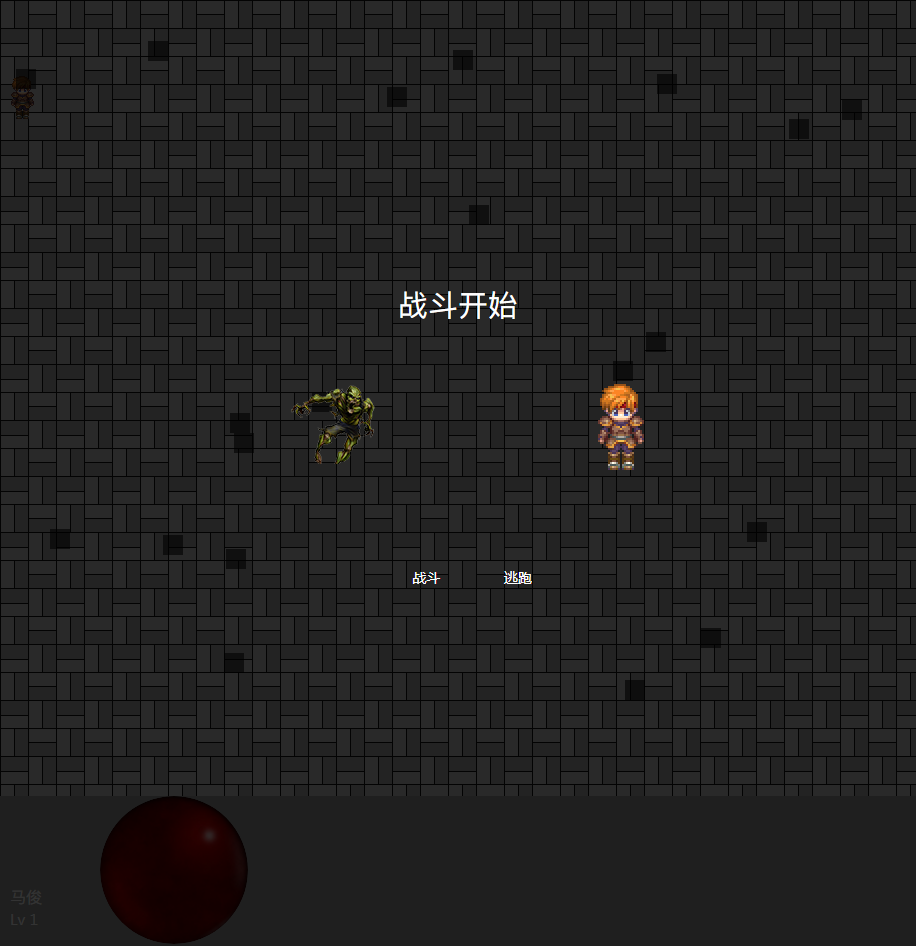

 [](https://github.com/facebook/react) [](http://opensource.org/licenses/MIT) [](https://reactjs.org/docs/how-to-contribute.html#your-first-pull-request)

[中文](./README_ZH.md) • [English](./README.md) 

## preview



## quick start

download
```
git clone git@gitee.com:shenzhepei/game.git
   
```

start development
```
npm run dev  // start server
```

start product
```
npm run build  // webpack build 
```

## License

[MIT](LICENSE)

